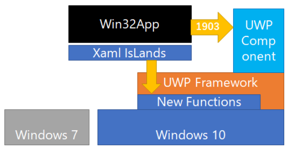
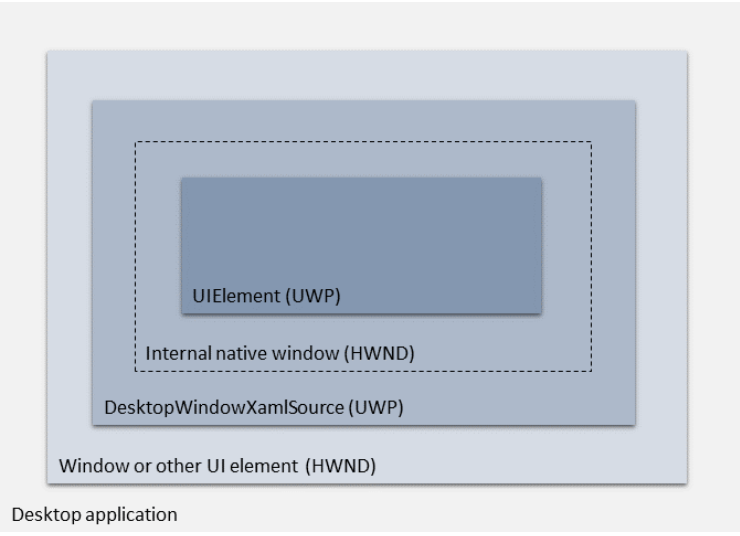
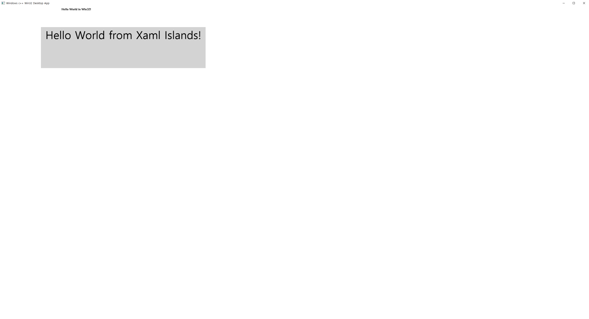

# XAML Islands
- Microsoft는 [2018년에 "XAML Islands"](https://blogs.windows.com/windowsdeveloper/2018/11/02/xaml-islands-a-deep-dive-part-1/#XY6MjWpSuFZevRt0.97 )라는 기술을 발표했다. 
- 이 기술을 이용하면 개발자는 「Windows Forms」, 「Windows Presentation Foundation」(WPF), **네이티브 Win32** 등 사용하고 있는 UI 스택에 관계 없이 XAML에 접근 할 수 있게 된다.
- **Windows 10 May 2019 Update(버전 1903)** 부터 Win32에서 바로 Windows Runtime(WinRT)를 사용할 수 있다.
   
- UWP XAML 호스팅 API는 C++ Win32 응용 프로그램에서 Windows.xaml에서 파생 되는 UWP 컨트롤을 호스트 하는데 사용할 수 있는 몇 가지 Windows 런타임 클래스 및 COM 인터페이스로 구성된다. 연결된 창 핸들 (HWND)이 있는 응용 프로그램의 모든 UI 요소에서 UWP 컨트롤을 호스트할 수 있다. 
  

[Windows UI Library Roadmap](https://github.com/microsoft/microsoft-ui-xaml/blob/master/docs/roadmap.md )   
[GitHub-XamlIslands](https://github.com/microsoft/microsoft-ui-xaml/blob/master/docs/roadmap.md)  
  

## 사용 조건   
- 프로젝트가 [C++/winrt](https://docs.microsoft.com/ko-kr/windows/uwp/cpp-and-winrt-apis)를 지원해야 한다.
    - 새 프로젝트의 경우 [C++/winrt Visual Studio 확장(VSIX)](https://marketplace.visualstudio.com/items?itemName=CppWinRTTeam.cppwinrt101804264 )을 설치하고 해당 확장에 포함된 C++/winrt 프로젝트 템플릿 중 하나를 사용할 수 있다. **설치 안해도 될듯**
    - 기존 프로젝트의 경우 프로젝트에 [CppWinRT NuGet 패키지](https://www.nuget.org/packages/Microsoft.Windows.CppWinRT/ )를 설치할 수 있습니다.
  
  
## 배포
패키징을 하지 않고 배포를 한다면 [여기(nuget)](https://www.nuget.org/packages/Microsoft.Toolkit.Win32.UI.SDK )에서 빌드 런타임을 받은 후 앱과 같이 배포한다.  
  

## API의 아키텍처
자세한 설명은 [Docs](https://docs.microsoft.com/ko-kr/windows/apps/desktop/modernize/using-the-xaml-hosting-api#architecture-of-the-api )를 본다.  
  
   
    

## 프로젝트 만들기
1. Vsual Studio 2019에서 Windows 10 버전 1903 SDK (버전 10.0.18362) 또는 이후 릴리스가 설치된 경우 새 Windows 데스크톱 응용 프로그램 프로젝트를 만든다. 이 프로젝트는 C++, Windows 및 데스크톱 프로젝트 필터 아래에서 사용할 수 있다.
2. 솔루션 탐색기에서 솔루션 노드를 마우스 오른쪽 단추로 클릭하고, 솔루션 대상 변경을 클릭하고, 10.0.18362.0 또는 이후 버전의 SDK 릴리스를 선택한 다음 확인을 클릭한다.
3. CppWinRT NuGet 패키지를 설치한다.
  
  
## Sample
- [CppWinRT_Win32_SimpleApp/Win32DesktopApp](https://github.com/marb2000/XamlIslands/tree/master/1903_Samples/CppWinRT_Win32_SimpleApp/Win32DesktopApp )   
   
- [CppWinRT_Win32_App/SampleCppApp/](https://github.com/marb2000/XamlIslands/tree/master/1903_Samples/CppWinRT_Win32_App/SampleCppApp )  
- [Win32 HelloComposition 샘플](https://github.com/Microsoft/Windows.UI.Composition-Win32-Samples/tree/master/cpp/HelloComposition )
    - [설명](https://docs.microsoft.com/ko-kr/windows/apps/desktop/modernize/using-the-visual-layer-with-win32 )
  
## 라이브러리
- [UWPLib: Include XAML Controls in Plain Win32](https://www.codeproject.com/Articles/1279856/UWPLib-Include-XAML-Controls-in-Plain-Win32 )
