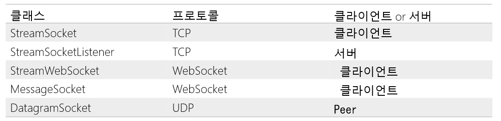

# cppwinrt
Windows8 에서 WinRT 라는 것이 생겼다.   
이것은 아직은 우리가 많이 사용하지 않는 다른 Windows API를 사용하는 것이다.  
자세한 것은 [위키피디아의 설명](https://ko.wikipedia.org/wiki/%EC%9C%88%EB%8F%84%EC%9A%B0_%EB%9F%B0%ED%83%80%EC%9E%84)을 보자.  
   
> 윈도우 런타임(Windows Runtime), 또는 간단히 WinRT는 2012년 윈도우 8과 윈도우 서버 2012에 도입된 플랫폼 이기종 응용 프로그램 구조이다.  
> WinRT는 C++/CX(C++ > 기반 언어인 구성 요소 확장)과 매니지드 코드 언어 C 샤프와 VB.NET, 자바스크립트, 타입스크립트의 개발을 지원한다.  
> WinRT 응용 프로그램들은 x86과 ARM 아키텍처를 둘 다 네이티브로 지원하며, 더 나은 보안과 안정성을 위해 샌드박스 환경에서 실행할 수 있다.  
> WinRT의 구성 요소들은 네이티브, 매니지드, 스크립트 언어를 포함하여 여러 언어와 API 간의 상호운용성을 염두에 두고 설계되었다.  
  
WinRT는 Windows 8, 10의 전용 앱((지금은 UWP 라고 부르는)을 만들 때만 사용하는 것으로 알려져서 많이 모를 것이다.  
그런데 WinRT는 일반적인 데스크탑 앱을 만들 때도 사용할 수 있다.  
특히 C++의 경우 Win32 API는 사용하기 쉬운 API가 잘 없는데 WinRT는 API 디자인이 닷넷과 비슷해서 C++ 프로그래밍에 WinRT를 사용하면 프로그래밍이 편리해질 수 있다.  
단점은 Windows 10(Windows Server 2016) 이상에서 실행하는 앱에만 사용할 수 있다.  
리눅스나 맥에서는 사용할 수 없다.  
  
이 단점은 Windows 에서 게임 서버나 게임 툴을 만드는 경우는 단점이 안 될 수 있으므로 게임쪽에서는 WinRT를 알아두면 좋다고 생각한다.  
  
WinRT를 C++에서 사용하기 쉽도록 하는 [cppwinrt](https://docs.microsoft.com/ko-kr/windows/uwp/cpp-and-winrt-apis/) 라는 라이브러리가 있다.  
원래 개인이 만든 것인데 이것을 만든 분이 MS에 입사하면서 지금은 MS 에서 관리하는 것 같다.  
그리고 [다음 Windows SDK에 기본으로 들어간다고 한다(2017년 11월)](https://blogs.msdn.microsoft.com/vcblog/2017/11/01/cppwinrt-is-now-included-the-windows-sdk/).  
    
SDK에 기본으로 들어가면 조금만 설정하면 기존 네이티브 C++에서 WinRT 라이브러리를 사용할 수 있으니 아주 좋을 것 같다.  
아직 SDK가 나오지 않았지만 지금도 조금만 설정을 하면 쉽게 WinRT를 사용할 수 있다.  
라이브러리는 헤더파일만 추가하면 되고, c++ 프로젝트 설정에서 조금 손을 보면 된다.  
      
[Nuget](https://www.nuget.org/packages/Microsoft.Windows.CppWinRT/ ) 최신 C++/WinRT 라이브러리를 프로젝트 설치할 수 있다.    
  

## 예제: 콘솔 앱
- 콘솔 앱을 만든다.
- NuGet에서 cppwinrt를 설치한다.
    - Nuget으로 설치하면서 필요한 옵션을 설정한다.
  
자세한 것은 [이 글](https://docs.microsoft.com/ko-kr/windows/uwp/cpp-and-winrt-apis/intro-to-using-cpp-with-winrt )을 본다.  
  
```
#include <stdio.h>
#include <winrt/Windows.Foundation.h>
using namespace winrt;

int main()
{
	init_apartment();
	Windows::Foundation::Uri uri(L"https://microsoft.com/build");
	printf("Welcome to %ls!\n", uri.Path().c_str());
}
```  
  

## 문자열 winrt::hstring
std::wstring와 비슷하다.  
  
```
#include <winrt/Windows.Foundation.h>
#include <string_view>

using namespace winrt;
using namespace Windows::Foundation;

int main()
{
    using namespace std::literals;

    winrt::init_apartment();

    // You can make a Uri from a wide string literal.
    Uri contosoUri{ L"http://www.contoso.com" };

    // Or from a wide string view.
    Uri contosoSVUri{ L"http://www.contoso.com"sv };

    // Or from a std::wstring.
    std::wstring wideString{ L"http://www.adventure-works.com" };
    Uri awUri{ wideString };

    // Access a property of type hstring, via a conversion operator to a standard type.
    std::wstring domainWstring{ contosoUri.Domain() }; // L"contoso.com"
    domainWstring = awUri.Domain(); // L"adventure-works.com"
}
```
  
### std::wstring, std::wstring_view로 변환 
```
#include <iostream>
std::wcout << tostringHstring.c_str() << std::endl;
```
  
```
void legacy_print(std::wstring_view view);

void Print(winrt::hstring const& hstring)
{
    legacy_print(hstring);
}
```  
  
### std::string로 변환
```
winrt::hstring w{ L"Hello, World!" };

std::string c = winrt::to_string(w);
WINRT_ASSERT(c == "Hello, World!");

w = winrt::to_hstring(c);
WINRT_ASSERT(w == L"Hello, World!");
```
   
https://docs.microsoft.com/ko-kr/windows/uwp/cpp-and-winrt-apis/strings  
  

## boxing
타입을 `winrt::Windows::Foundation::IInspectable`로 boxing 한후 unboxing 할 수 있다.  
```
void Unbox(winrt::Windows::Foundation::IInspectable const& object)
{
    hstring hstringValue = unbox_value<hstring>(object); // Throws if object is not a boxed string.
    hstringValue = unbox_value_or<hstring>(object, L"Default"); // Returns L"Default" if object is not a boxed string.
    float floatValue = unbox_value_or<float>(object, 0.f); // Returns 0.0 if object is not a boxed float.
}
```
  
설명: https://docs.microsoft.com/ko-kr/windows/uwp/cpp-and-winrt-apis/boxing  
  

## winrt::array_view
https://docs.microsoft.com/ko-kr/windows/uwp/cpp-and-winrt-apis/std-cpp-data-types  
  

## 컬렉션
https://docs.microsoft.com/ko-kr/windows/uwp/cpp-and-winrt-apis/collections    


## DataWriter Class
https://docs.microsoft.com/ko-kr/windows/uwp/cpp-and-winrt-apis/std-cpp-data-types
https://docs.microsoft.com/ko-kr/uwp/api/windows.storage.streams.datawriter


## 이벤트 작성
https://docs.microsoft.com/ko-kr/windows/uwp/cpp-and-winrt-apis/author-events
  


## WindowsRuntime 의 SocketAPI
     
  


## 비동기
https://docs.microsoft.com/ko-kr/windows/uwp/cpp-and-winrt-apis/concurrency  
https://docs.microsoft.com/ko-kr/windows/uwp/cpp-and-winrt-apis/concurrency-2  
더미 클라이언트 개발에 좋을 듯  
  

## UI 
https://docs.microsoft.com/ko-kr/windows/uwp/cpp-and-winrt-apis/binding-property  
https://docs.microsoft.com/ko-kr/windows/uwp/cpp-and-winrt-apis/binding-collection  
https://docs.microsoft.com/ko-kr/uwp/toolkits/winui/getting-started  
  
## Windows 런타임 ABI란 무엇이며, ABI 형식이란 무엇인가요?
https://docs.microsoft.com/ko-kr/windows/uwp/cpp-and-winrt-apis/interop-winrt-abi  
  
  

## WinRT API
https://docs.microsoft.com/ko-kr/uwp/api/  

### Windows.Data.Json
https://docs.microsoft.com/en-us/uwp/api/windows.data.json

  

## 참고 
- [MS Docs C++/WinRT](https://docs.microsoft.com/ko-kr/windows/uwp/cpp-and-winrt-apis/ )
- [Meet C++/WinRT 2.0: Faster and smarter in the open(build 2019)](https://mybuild.techcommunity.microsoft.com/sessions/77016?source=sessions  )